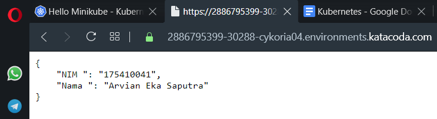

Nama	: Arvian Eka Saputra

NIM		: 175410041

Kelas	: TI-9

________________________________________

# KUBERNETES

Kubernetes merupakan platform open-source yang digunakan untuk melakukan manajemen workloads aplikasi yang dikontainerisasi, serta menyediakan konfigurasi dan otomatisasi secara deklaratif.

## Komponen-Komponen Kubernetes

### Komponen Master

Komponen master menyediakan control plane bagi klaster. Komponen ini berperan dalam proses pengambilan secara global pada klaster, serta berperan dalam proses deteksi serta pemberian respons terhadap events yang berlangsung di dalam klaster. Komponen master dapat dijalankan di mesin manapun yang ada di klaster, untuk memudahkan proses yang ada, script inisiasi awal yang dijalankan biasanya memulai komponen master pada mesin yang sama, serta tidak menjalankan kontainer bagi pengguna di mesin ini.

#### kube-apiserver

Komponen di master yang mengekspos API Kubernetes. Merupakan front-end dari kontrol plane Kubernetes. Komponen ini didesain agar dapat di-scale secara horizontal.

#### etcd

Penyimpanan key value konsisten yang digunakan sebagai penyimpanan data klaster Kubernetes.

#### kube-scheduler

Komponen di master yang bertugas mengamati pod yang baru dibuat dan belum di-assign ke suatu node dan kemudian akan memilih sebuah node dimana pod baru tersebut akan dijalankan.

Faktor-faktor yang diperhatikan dalam proses ini adalah kebutuhan resource secara individual dan kolektif, konstrain perangkat keras/perangkat lunak/peraturan, spesifikasi afinitas dan non-afinitas, lokalisasi data, interferensi inter-workload dan deadlines.

#### kube-controller-manager

Komponen di master yang menjalankan kontroler. Secara logis, setiap kontroler adalah sebuah proses yang berbeda, tetapi untuk mengurangi kompleksitas, kontroler-kontroler ini dikompilasi menjadi sebuah binary yang dijalankan sebagai satu proses. Kontroler-kontroler ini meliputi:

- Kontroler Node : Bertanggung jawab untuk mengamati dan memberikan respons apabila jumlah node berkurang.
- Kontroler Replikasi : Bertanggung jawab untuk menjaga jumlah pod agar jumlahnya sesuai dengan kebutuhan setiap objek kontroler replikasi yang ada di sistem.
- Kontroler Endpoints : Menginisiasi objek Endpoints (yang merupakan gabungan Pods dan Services).
- Kontroler Service Account & Token: Membuat akun dan akses token API standar untuk setiap namespaces yang dibuat.

#### cloud-controller-manager

Merupakan kontroler yang berinteraksi dengan penyedia layanan cloud. Adanya cloud-controller-manager memungkinkan kode yang dimiliki oleh penyedia layanan cloud dan kode yang ada pada Kubernetes saling tidak bergantung selama masa development. Kontroler berikut ini memiliki keterkaitan dengan penyedia layanan cloud:

- Kontroler Node : Melakukan pengecekan pada penyedia layanan cloud ketika menentukan apakah sebuah node telah dihapus pada cloud apabila node tersebut berhenti memberikan respons.
- Kontroler Route : Melakukan pengaturan awal route yang ada pada penyedia layanan cloud
- Kontroler Service : Untuk membuat, memperbaharui, menghapus load balancer yang disediakan oleh penyedia layanan cloud
- Kontroler Volume : Untuk membuat, meng-attach, dan melakukan mount volume serta melakukan inetraksi dengan penyedia layanan cloud untuk melakukan orkestrasi volume

### Komponen Node

Komponen ini ada pada setiap node, fungsinya adalah melakukan pemeliharaan terhadap pod serta menyediakan environment runtime bagi Kubernetes.

#### kubelet

Agen yang dijalankan pada setiap node di klaster dan bertugas memastikan kontainer dijalankan di dalam pod.

#### kube-proxy

Membantu abstraksi service Kubernetes melakukan tugasnya.

#### Container Runtime

Container runtime adalah perangkat lunak yang bertanggung jawab dalam menjalankan kontainer.

### KASUS

#### Membuat docker image

1. Membuat direktori dan masuk ke direktori tersebut

    ```
    $ mkdir kuber-arv
    $ cd kuber-arv
    ```

2. Membuat 3 buah file seperti dibawah ini :

    ```
    $ nano dockerfile
    $ nano app.py
    $ nano requirements.txt

    ```

3. Membuat docker image

    ```
    $ docker build -t arviansapu/kuber-arv-img .
    ```

    ```
    Sending build context to Docker daemon  4.096kB
    Step 1/6 : FROM python:2.7
    2.7: Pulling from library/python
    8f0fdd3eaac0: Pull complete
    d918eaefd9de: Pull complete
    43bf3e3107f5: Pull complete
    27622921edb2: Pull complete
    dcfa0aa1ae2c: Pull complete
    ef6ca6913068: Pull complete
    a755ea00feee: Pull complete
    74b6f9ff9fd6: Pull complete
    bebb4b693476: Pull complete
    Digest: sha256:9517f5314968111658d229ed3038630a174e7a4f1b852bd185b70f614dffba08
    Status: Downloaded newer image for python:2.7
    ---> 426ba9523d99
    Step 2/6 : COPY . /app
    ---> 141605de65a6
    Step 3/6 : WORKDIR /app
    ---> Running in f71dc19ff822
    Removing intermediate container f71dc19ff822
    ---> 422dacb7b41a
    Step 4/6 : RUN pip install -r requirements.txt
    ---> Running in f68ce826ac22
    DEPRECATION: Python 2.7 will reach the end of its life on January 1st, 2020. Please upgrade your Python as Python 2.7 won't be maintained after that date. A future version of pip will drop support for Python 2.7. More details about Python 2 support in pip, can be found at https://pip.pypa.io/en/latest/development/release-process/#python-2-support
    Collecting flask
    Downloading https://files.pythonhosted.org/packages/9b/93/628509b8d5dc749656a9641f4caf13540e2cdec85276964ff8f43bbb1d3b/Flask-1.1.1-py2.py3-none-any.whl (94kB)
    Collecting flask_restful
    Downloading https://files.pythonhosted.org/packages/17/44/6e490150ee443ca81d5f88b61bb4bbb133d44d75b0b716ebe92489508da4/Flask_RESTful-0.3.7-py2.py3-none-any.whl
    Collecting itsdangerous>=0.24
    Downloading https://files.pythonhosted.org/packages/76/ae/44b03b253d6fade317f32c24d100b3b35c2239807046a4c953c7b89fa49e/itsdangerous-1.1.0-py2.py3-none-any.whl
    Collecting Jinja2>=2.10.1
    Downloading https://files.pythonhosted.org/packages/65/e0/eb35e762802015cab1ccee04e8a277b03f1d8e53da3ec3106882ec42558b/Jinja2-2.10.3-py2.py3-none-any.whl (125kB)
    Collecting click>=5.1
    Downloading https://files.pythonhosted.org/packages/fa/37/45185cb5abbc30d7257104c434fe0b07e5a195a6847506c074527aa599ec/Click-7.0-py2.py3-none-any.whl (81kB)
    Collecting Werkzeug>=0.15
    Downloading https://files.pythonhosted.org/packages/ce/42/3aeda98f96e85fd26180534d36570e4d18108d62ae36f87694b476b83d6f/Werkzeug-0.16.0-py2.py3-none-any.whl (327kB)
    Collecting aniso8601>=0.82
    Downloading https://files.pythonhosted.org/packages/eb/e4/787e104b58eadc1a710738d4e418d7e599e4e778e52cb8e5d5ef6ddd5833/aniso8601-8.0.0-py2.py3-none-any.whl (43kB)
    Collecting pytz
    Downloading https://files.pythonhosted.org/packages/e7/f9/f0b53f88060247251bf481fa6ea62cd0d25bf1b11a87888e53ce5b7c8ad2/pytz-2019.3-py2.py3-none-any.whl (509kB)
    Collecting six>=1.3.0
    Downloading https://files.pythonhosted.org/packages/65/26/32b8464df2a97e6dd1b656ed26b2c194606c16fe163c695a992b36c11cdf/six-1.13.0-py2.py3-none-any.whl
    Collecting MarkupSafe>=0.23
    Downloading https://files.pythonhosted.org/packages/fb/40/f3adb7cf24a8012813c5edb20329eb22d5d8e2a0ecf73d21d6b85865da11/MarkupSafe-1.1.1-cp27-cp27mu-manylinux1_x86_64.whl
    Installing collected packages: itsdangerous, MarkupSafe, Jinja2, click, Werkzeug, flask, aniso8601, pytz, six, flask-restful
    Successfully installed Jinja2-2.10.3 MarkupSafe-1.1.1 Werkzeug-0.16.0 aniso8601-8.0.0 click-7.0 flask-1.1.1 flask-restful-0.3.7 itsdangerous-1.1.0 pytz-2019.3 six-1.13.0
    Removing intermediate container f68ce826ac22
    ---> 750a2c273201
    Step 5/6 : ENTRYPOINT ["python"]
    ---> Running in 7e917d584d82
    Removing intermediate container 7e917d584d82
    ---> d7d846199377
    Step 6/6 : CMD ["app.py"]
    ---> Running in 125a7ef295d9
    Removing intermediate container 125a7ef295d9
    ---> 096b9208a927
    Successfully built 096b9208a927
    Successfully tagged arviansapu/kuber-arv-img:latest
    ```

4. Memastikan docker image sudah dibuat

    ```
    $ docker images
    ```

    ```
    REPOSITORY                                      TAG                 IMAGE ID            CREATED             SIZE
    arviansapu/kuber-arv-img                        latest              096b9208a927        54 seconds ago      903MB
    ```

5. Login docker

    ```
    $ docker login
    ```

    ```
    Login with your Docker ID to push and pull images from Docker Hub. If you don't have a Docker ID, head over to https://hub.docker.com to create one.
    Username: 
    Password:
    WARNING! Your password will be stored unencrypted in /root/.docker/config.json.
    Configure a credential helper to remove this warning. See
    https://docs.docker.com/engine/reference/commandline/login/#credentials-store

    Login Succeeded
    ```

6. Push image ke dalam dockerhub

    ```
    $ docker push arviansapu/kuber-arv-img
    ```
    
    ```
    The push refers to repository [docker.io/arviansapu/kuber-arv-img]
    8008cc9b1a96: Preparing
    d63918a3f8d4: Preparing
    8008cc9b1a96: Pushed
    03a3dc679282: Mounted from library/python
    35fc403d4c4c: Mounted from library/python
    c1fbc35a2660: Mounted from library/python
    f63773c65620: Mounted from library/python
    e6d60910d056: Mounted from library/python
    b52c1c103fae: Mounted from library/python
    6f1c84e6ec59: Mounted from library/python
    dd5242c2dc8a: Mounted from library/python
    latest: digest: sha256:6370c2fb0d37e560d5a093c0908dcb2b670e034d074eb96d5f0e1412585ee593 size: 2639
    ```

#### Menjalankan Docker Image

1. Deploy image yang sudah dibuat kedalam kubernetes

    ```
    $ kubectl create deployment arv-py-flask --image=arviansapu/kuber-arv-img
    ```

    ```
    deployment.apps/arv-py-flask created
    ```

2. Cek status deployment dan pod

    ```
    $ kubectl get deployments
    NAME           READY   UP-TO-DATE   AVAILABLE   AGE
    arv-py-flask   0/1     1            0           18s
    ```

    ```
    $ kubectl get pods
    NAME                          READY   STATUS    RESTARTS   AGE
    arv-py-flask-7bc6d995-59vrw   1/1     Running   0          45s
    ```

3. Buat service yang memproses image docker yang telah dideploy

    ```
    $ kubectl expose deployment arv-py-flask --type=LoadBalancer --port=5000
    ```

    ```
    service/arv-py-flask exposed
    ```

4. Cek service yang dibuat sudah berjalan atau belum

    ```
    $ kubectl get services
    ```

    ```
    NAME           TYPE           CLUSTER-IP      EXTERNAL-IP   PORT(S)          AGE
    arv-py-flask   LoadBalancer   10.96.150.220   <pending>     5000:31851/TCP   13s
    kubernetes     ClusterIP      10.96.0.1       <none>        443/TCP          18m
    ```

5. Coba akses melalui browser menggunakan port yang telah tertulis pada service

    